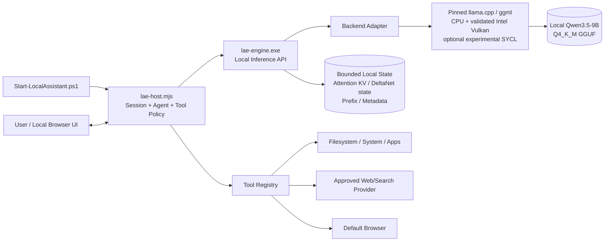

# System Architecture

## 1. Architecture decision

The MVP is a **repository-owned local assistant platform** with a narrow native inference backend and a separate agent/tool host.

- The native engine is C/C++ and links a pinned, vendored llama.cpp/ggml source revision behind an internal adapter.
- The assistant host is a zero-dependency Node.js 24 ESM application.
- The UI is static HTML/CSS/JavaScript served on loopback.
- Model weights are external and read-only.
- All processes run in the foreground and terminate together.
- Internet access is a property of selected tools, not a requirement of inference.
- The target does not install or build anything.

This approach deliberately avoids writing a general tensor framework. The product owns the operational behavior and can progressively replace backend components through a stable internal interface.

## 2. Component view



## 3. Process model

### Launcher

`Start-LocalAssistant.ps1`:

1. Resolves the release directory.
2. Loads `config.local.json` if present.
3. Resolves the model path without printing sensitive paths unnecessarily.
4. Invokes `lae-engine.exe verify-model`.
5. Checks available system memory and disk space.
6. Selects the approved CPU/GPU binary/profile using the hardware receipt.
7. Creates a restrictive temporary runtime directory.
8. Generates random in-memory/local-file bearer tokens with user-only permissions.
9. Starts the native engine as a child process.
10. Reads a machine-readable readiness record from stdout.
11. Starts `lae-host.mjs` with the engine endpoint and token.
12. Opens the local UI only after host readiness.
13. Relays Ctrl+C and shutdown.
14. Kills the entire child process tree on exit.
15. Deletes temporary token files and ephemeral state.

The launcher does not install, elevate, edit the registry, or alter global environment settings.

### Native engine

`lae-engine.exe` supports subcommands:

- `serve`
- `chat` for diagnostic CLI use
- `verify-model`
- `probe`
- `benchmark`
- `version`
- `print-build-info`

The engine:

- Maps and validates the GGUF.
- Creates the backend/model/context.
- Exposes a loopback HTTP API.
- Performs tokenization, chat template rendering, prefill, decode, sampling, and streaming.
- Manages bounded hybrid sequence state: attention KV, recurrent/Gated DeltaNet state, optional MTP state, and prefix cache.
- Exposes health, readiness, cancellation, and metrics endpoints.
- Contains no web client and no cloud fallback.
- Treats the llama.cpp/ggml substrate as an internal implementation detail.

### Assistant host

`lae-host.mjs`:

- Supervises and authenticates to the engine.
- Exposes the local UI and assistant API.
- Maintains conversation records and truncation/summarization policy.
- Builds compact system/tool prompts.
- Parses model tool calls.
- Validates tool schemas.
- Applies risk policy and confirmation.
- Executes tools.
- Returns tool results to the model.
- Streams answer and tool events to the UI.
- Separates offline and network-capable tools.
- Redacts logs and protects secrets.
- Does not import npm packages at runtime.

### Static UI

The first UI needs:

- Model/load status.
- CPU/GPU backend and context profile.
- New/reset session.
- Normal/deep mode.
- Streaming transcript.
- Tool-call cards with pending confirmation.
- Stop/cancel.
- Cache and performance summary.
- Clear offline/network-provider status.
- Export transcript only by explicit user action.
- No remote fonts, analytics, CDNs, telemetry, or external assets.

## 4. Internal backend boundary

The code must define a narrow interface such as:

```text
EngineBackend
  initialize(model_path, model_manifest, runtime_config)
  tokenize(text, add_special)
  render_chat(messages, tools, mode)
  create_session(session_config)
  prefill(session, tokens, cancellation)
  decode(session, sampling_config, cancellation, token_sink)
  save_prefix(session, prefix_key)
  restore_prefix(session, prefix_key)
  reset_session(session)
  metrics()
  shutdown()
```

The rest of the product must not call upstream backend internals directly. This makes it possible to:

- Pin and patch upstream safely.
- Test an alternate backend.
- Add custom kernels.
- Replace the backend later.
- Keep tool/host code stable.
- Maintain a small auditable surface.

## 5. API surfaces

### Engine API

Default bind: `127.0.0.1` on an ephemeral port.

Mandatory endpoints:

- `GET /healthz`
- `GET /readyz`
- `GET /version`
- `GET /metrics`
- `POST /v1/chat/completions`
- `POST /v1/tokenize`
- `POST /v1/cancel/{request_id}`
- `POST /v1/sessions`
- `DELETE /v1/sessions/{session_id}`

The chat endpoint implements the subset needed by the host:

- Streaming SSE and non-streaming JSON.
- System, user, assistant, and tool roles.
- Stop reasons.
- Token usage.
- Request ID.
- Session ID.
- Normal/deep mode.
- Optional grammar constraint generated by the host.
- No remote URL inputs.
- No file-path inputs other than engine startup model path.

### Assistant host API

Default bind: separate `127.0.0.1` ephemeral port.

Mandatory endpoints:

- `GET /`
- `GET /api/status`
- `POST /api/sessions`
- `POST /api/chat`
- `POST /api/cancel`
- `POST /api/tool-confirmations/{id}`
- `GET /api/events/{request_id}` or WebSocket/SSE equivalent
- `POST /api/shutdown`

The host API emits typed events:

```text
message.started
message.delta
message.completed
reasoning.started
reasoning.completed
tool.proposed
tool.confirmation_required
tool.started
tool.output
tool.completed
tool.failed
request.cancelled
request.failed
metrics.snapshot
```

Reasoning deltas are not exposed or persisted by default.

## 6. Request lifecycle

1. UI sends a user message to the host with session ID and mode.
2. Host validates size, session state, and CSRF/local token.
3. Host selects only relevant tool schemas.
4. Host renders the pinned Qwen3.5 chat template and sets structured `enable_thinking: false|true`; it does not depend on legacy slash-command injection.
5. Host sends the request to the engine.
6. Engine restores the immutable system/tool prefix cache where safe.
7. Engine prefills new tokens and streams decode.
8. If ordinary answer text is emitted, host streams it to UI.
9. If the pinned Qwen3.5 template emits a tool-call event:
   - Host withholds partial tool syntax from the transcript.
   - The adapter normalizes the complete call into the canonical JSON envelope.
   - The normal native-template path is parsed without treating arbitrary prose as executable.
   - A constrained `no_tool | tool_call` grammar is reserved for a dedicated decision/repair generation and begins at token zero of that generation; no mid-stream grammar-switch assumption is made.
   - Host parses and validates the complete object before any policy decision or execution.
10. Host assigns risk level and asks for confirmation when required.
11. Tool executes with deadline, output cap, and cancellation.
12. Host appends a structured tool result to the conversation.
13. The same model continues the turn.
14. The loop stops on final answer, cancellation, call limit, context limit, timeout, or policy denial.
15. Host records metadata metrics and updates bounded session state.

## 7. Tool-call format

Canonical model envelope:

```json
{
  "id": "call_opaque",
  "name": "fs.read_text",
  "arguments": {
    "path": "notes/project.md",
    "max_bytes": 65536
  }
}
```

Tool result envelope:

```json
{
  "id": "call_opaque",
  "name": "fs.read_text",
  "status": "ok",
  "content": [
    {
      "type": "text",
      "text": "..."
    }
  ],
  "metadata": {
    "truncated": false,
    "duration_ms": 12
  }
}
```

The model never chooses the risk level. Policy assigns it.

## 8. Model and tokenizer handling

- Use GGUF tokenizer and chat-template metadata from the accepted file.
- Validate the template against a pinned golden representation.
- Reject unknown template changes rather than executing unexpected model-provided logic.
- Normalize messages in the host and render through the backend adapter.
- Keep tool schemas compact and deterministic.
- Default to non-thinking for tool decisions.
- Detect and suppress model reasoning blocks from normal user output unless a future approved UI mode explicitly displays them.
- Apply stop tokens based on model metadata and tested chat behavior.
- Treat Qwen3.5 as a hybrid model: session lifecycle, cloning, reset, cancellation, and prefix reuse must include attention KV plus recurrent/Gated DeltaNet state.
- Keep MTP/self-speculative execution disabled until a separate parity and stability gate passes; MTP training does not make speculative decoding automatically safe in the product runtime.
- The MVP is text-only: no vision projection is loaded, and non-text inputs receive a typed `modality_not_enabled` error.

## 9. Caching architecture

### Model mapping and OS cache

- Open the model once per foreground engine lifetime.
- Use read-only memory mapping.
- Avoid a full duplicate host copy.
- Let the OS page cache retain hot model pages.
- Optionally use conservative Windows prefetch APIs after measurement.
- Do not lock all model pages into RAM.

### Immutable prefix cache

Cache only prefixes proven identical:

- Model identity.
- Chat template version.
- System prompt version.
- Active tool-schema bundle version.
- Generation mode.
- Context/cache type.
- Backend configuration affecting state.

System/tool prefixes may be reused across sessions because they contain no user content. User-derived prefix reuse is session-scoped by default.

### Session sequence-state cache

- One active decode.
- Store and restore both attention KV and recurrent/Gated DeltaNet sequence state; never restore one without the other.
- MTP draft state is disabled by default and versioned separately if later enabled.
- Bounded stored sessions.
- Explicit reset.
- LRU eviction.
- No persistence by default.
- Page/block allocator may be used after basic correctness.
- Cache blocks are zeroed or released on session deletion.
- Session IDs are unguessable local identifiers.

### Tool-result cache

- Disabled for mutations.
- Memory-only by default.
- Key includes tool version and normalized arguments.
- TTL and sensitivity label.
- No cross-session reuse for local file or clipboard content unless explicitly safe.
- Network results include URL/provider and expiry.
- Cache hit is shown in metadata.

### Kernel/shader autotune cache

- Versioned by engine build, CPU signature, GPU IDs, driver, backend, model, and relevant parameters.
- Contains performance choices only, not prompts or model outputs.
- Invalidated on any signature mismatch.
- Bounded and safe to delete.

## 10. Memory management

- Startup computes a resource plan before model initialization.
- Allocations use checked arithmetic.
- The engine reserves a maximum context and cache envelope rather than unbounded growth.
- Scratch buffers are reused.
- Host request history has byte and token bounds.
- Tool output is truncated before being inserted into context.
- Long files are chunked and summarized only after user intent is clear.
- Available-memory checks occur before large context growth.
- On memory pressure, reject or reduce optional cache; do not let Windows page heavily.
- Metrics expose working set, committed bytes, mapped bytes, cache bytes, and GPU allocation.

## 11. CPU execution

The release strategy should support the target CPU without local compilation:

- A conservative baseline binary.
- An AVX2/FMA binary when supported.
- Optional AVX-512 build only if relevant and tested.
- Launcher-based or internal runtime selection.
- Thread pool configured from measured physical/logical topology.
- One or more logical cores reserved for UI/OS responsiveness.
- Prefill and decode thread counts independently tunable.
- Affinity used only after measurement and never as a default policy hack.

The CPU path is the correctness reference for the accelerated path.

## 12. Intel GPU execution

The exact Intel adapter is discovered through the Phase 0 hardware receipt. The release contains distinct, identifiable profiles rather than one opaque “GPU” mode:

- `cpu-baseline` and `cpu-avx2` as mandatory correctness/fallback paths.
- `intel-vulkan-conservative` as the first acceleration candidate.
- `intel-vulkan-tuned` only after device/driver-specific promotion.
- `intel-sycl-experimental` only for controlled testing until separately promoted.

Vulkan is eligible when:

- the existing approved Intel driver exposes a working Vulkan device,
- the pinned llama.cpp Qwen3.5 path passes tokenizer, short/long prompt, hybrid-state, cache-reset, cancellation, and tool-call parity tests,
- dedicated/shared-memory telemetry leaves display and Windows headroom,
- no driver reset, corrupted output, silent CPU fallback, or cross-turn contamination occurs, and
- it materially improves end-to-end latency over tuned CPU.

The engine supports full or partial offload, but it reports actual tensor/operator placement and backend fallback. Offload count is never inferred solely from nominal shared-memory capacity. Cooperative-matrix, Flash-Attention, cache quantization, MTP, and large batch settings are independently gated because a combination that works on one Intel generation or driver may fail on another.

The launcher falls back to CPU on clean initialization failure. It does **not** silently retry a profile after output corruption or a driver reset; that profile is quarantined until revalidated. No target-side driver/runtime installation is permitted. The detailed probe, matrix, corruption regressions, and promotion rules in `governance/INTEL_GPU_BACKEND.md` are binding.

## 13. Browser and web design

Internet tools do not live in `lae-engine.exe`.

The host supports provider adapters:

1. `disabled`
2. `approved_http_search`
3. `approved_http_fetch`
4. `browser_open`
5. Future approved browser/CDP or enterprise search adapter

Provider credentials are injected at launch and never sent to the model. Redirects, response sizes, MIME types, and domains are controlled. Web text is marked as untrusted tool output. The model cannot treat webpage instructions as system policy.

Opening the default browser is distinct from extracting search results. The MVP can always demonstrate browser opening; live result-returning search requires a configured approved provider.

## 14. Local application and command design

- Applications are addressed by logical ID, not arbitrary executable path.
- The allowlist maps IDs to canonical executable paths and fixed argument policies.
- A command tool accepts an executable ID and an array of arguments.
- No shell string.
- No PowerShell `Invoke-Expression`.
- Working directory must be inside an allowed root.
- Environment is minimal and filtered.
- Process tree is killed on timeout/cancel.
- Output is bounded and decoded defensively.
- Mutating/high-risk tools require confirmation.

## 15. Configuration

Committed:

- `config.example.json`
- Tool schemas.
- Default resource limits.
- Model manifest template.
- No model path, secrets, or corporate endpoints.

Local-only:

- `config.local.json`
- Model path.
- Allowed workspace roots.
- Approved tool/application mapping.
- Search provider URL/credential reference.
- Log directory and retention.
- Optional accelerated backend selection.

Schema validation occurs before child processes start. Unknown configuration keys fail in strict mode.

## 16. Why not ONNX Runtime

ONNX Runtime is present, but it is not selected because:

- The accepted model artifact is GGUF.
- Conversion would require unavailable frameworks and a separate large artifact.
- The observed providers do not prove a useful local GPU path.
- Quantized LLM kernels, KV cache, chat template, and streaming behavior are better served by the selected backend.
- Using the Azure provider would violate the no-cloud-inference requirement unless explicitly redesigned and approved.

## 17. Why not Ollama, Docker, or a package-managed runtime

They are excluded because target availability and approval are not established, and they introduce installation/update dependencies. The release must remain a copied, verified, foreground package.

## 18. Future backend independence

After MVP, the `EngineBackend` boundary permits:

- A smaller custom Qwen3.5-aware runtime.
- Custom CPU quantized GEMV/GEMM kernels.
- Custom Vulkan shaders.
- DirectML or vendor-specific plugins.
- Alternative cache allocators.
- Speculative/self-speculative decoding.
- A multimodal model through a new ADR.

None of these may destabilize the first end-to-end assistant release.
